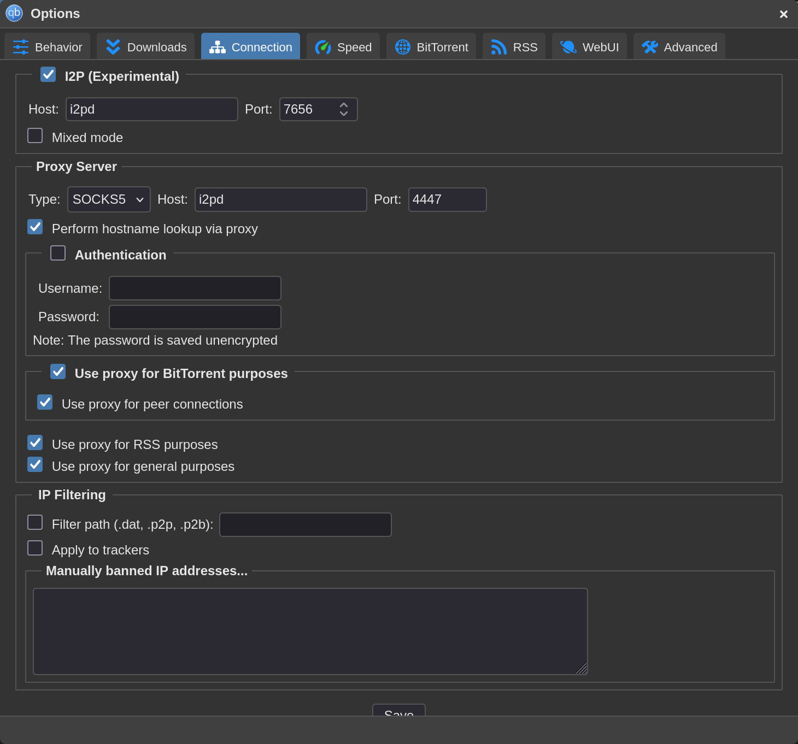
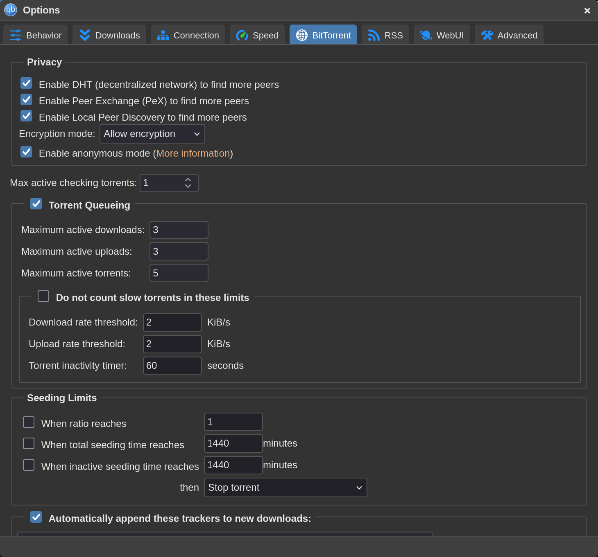
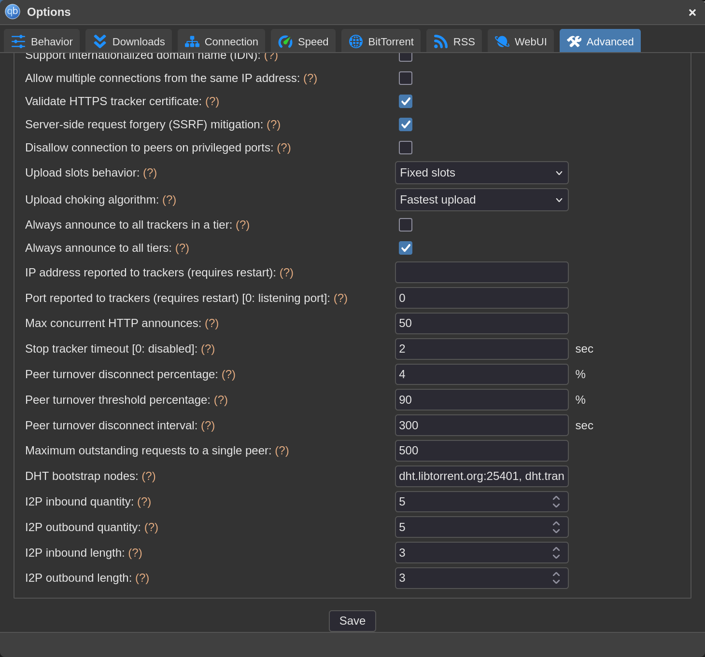

# i2pd + qBittorrent Setup in Podman

This is a simple guide for setting up qBittorrent with i2pd, so you can torrent on the I2P network.

## Create Podman Networks

To keep I2P traffic separate from your other Podman containers, it is best to create dedicated networks for this setup. This also helps prevent the qBittorrent container from communicating with the clearnet.

```bash
podman network create --internal isolated_i2p
```

`isolated_i2p` is the network that the qBittorrent container will use, so it will not be able to communicate with the clearnet.

```bash
podman network create i2p_net
```

`i2p_net` is the network that `i2pd` will use so it can communicate with other routers. You can name these networks whatever you want, but make sure you use the names correctly when creating the containers.

## Create the i2pd Container

```bash
podman run -d \
--name i2pd \
--net i2p_net \
--net isolated_i2p \
--restart unless-stopped \
-v i2pd_data:/var/lib/i2pd:z \
-p 127.0.0.1:7070:7070 `# optional` \
-p 127.0.0.1:4444:4444 `# optional` \
-p 127.0.0.1:4447:4447 `# optional` \
-p 4567:4567 \
-p 4567:4567/udp \
docker.io/purplei2p/i2pd:latest
```

`-v i2pd_data:...` creates a named volume. You can name the volume whatever you want, or mount it to a host directory if you prefer.

## Create the qBittorrent Container

```bash
podman run -d \
-e PUID=0 \
-e PGID=0 \
--name i2p-qbittorrent \
--net isolated_i2p \
-e TZ=Etc/UTC \
-e WEBUI_PORT=8080 \
-p 8080:8080 \
-v i2p_qbit_conf:/config:z \
-v /home/user/Downloads:/downloads:z \
--restart unless-stopped \
lscr.io/linuxserver/qbittorrent:latest
```

`-v i2p_qbit_conf:...` creates a named volume for the qBittorrent config. You can name it whatever you want, or mount it to a host directory instead.

`-v /home/user/Downloads:/downloads:z` mounts the directory where you want torrents to be downloaded.

Leave `-e PUID=0` and `-e PGID=0` as they are. Because of how the linuxserver.io container handles permissions, these need to be set to `root`, or `0` in this case.

Running the container with `PUID` and `PGID` set to `0` is safe in this setup because the container is running as root only inside its isolated environment. On the host system, especially when using rootless Podman, it does not have more privileges than your normal user account.

The setup is not finished yet. You still need to configure qBittorrent to use i2pd.

## Configure qBittorrent

After logging in to the Web UI, go to `Tools` -> `Options...`.

<br>



<br>

In `Options`, go to `Connection` and enable `I2P (Experimental)`.

For the host, enter the name of the i2pd container. For the port, enter `7656`.

For `Proxy Server`, select `SOCKS5`. The host should be the i2pd container name, and the port should be `4447`. Also enable `Host name lookup via proxy`.

Enable the other options that say `Use proxy for...`. See the screenshot above for reference.

<br>

Switch to the `BitTorrent` tab.

<br>



<br>

Enable `Anonymous mode`, and leave `DHT`, `PeX`, and `Local Peer Discovery` enabled as well.

<br>

Switch to the `Advanced` tab. This step is optional.

<br>



<br>

In `Advanced`, you can configure the I2P options.

| Option                  | Default | Range | What it does |
| ----------------------- | ------- | ----- | ------------ |
| `i2p_inbound_quantity`  | `3` | `1–16` | Number of inbound I2P tunnels kept available for other peers or services to reach you. More tunnels can improve reliability and incoming capacity, but they use more resources. |
| `i2p_outbound_quantity` | `3` | `1–16` | Number of outbound I2P tunnels kept available for connections you make to other I2P destinations. More tunnels can improve reliability and parallel connections, but they use more CPU and bandwidth. |
| `i2p_inbound_length`    | `3` | `0–7` | Number of hops in each inbound tunnel before traffic reaches you. Higher values improve anonymity, but increase latency and reduce speed. |
| `i2p_outbound_length`   | `3` | `0–7` | Number of hops in each outbound tunnel when you connect to other I2P destinations. Higher values improve anonymity, but make connections slower. |

I personally prefer to use `5 / 5 / 3 / 3`. See the reference screenshot.


Click the `Save` button after performing the above steps. 

## Test

If everything is set up correctly, you should be able to download any I2P torrent as long as it has active peers or seeders on I2P.

Use this magnet link to test whether qBittorrent and i2pd are configured correctly:

```text
magnet:?xt=urn:btih:c7fc714f75624601979f54bca0ed05d92feda3e4&dn=I2P+Propaganda&tr=http://tracker2.postman.i2p/announce.php
```

This is what the description of the torrent says:

```text
Please download and share this torrent. It includes I2P propaganda consisting of several posters, flyers, banners, etc...

Print them out, put them where many people can see them and spread the word about I2P. Thank you.
```

Use the magnet link so you can confirm that qBittorrent can fetch the metadata and download the torrent through I2P.
